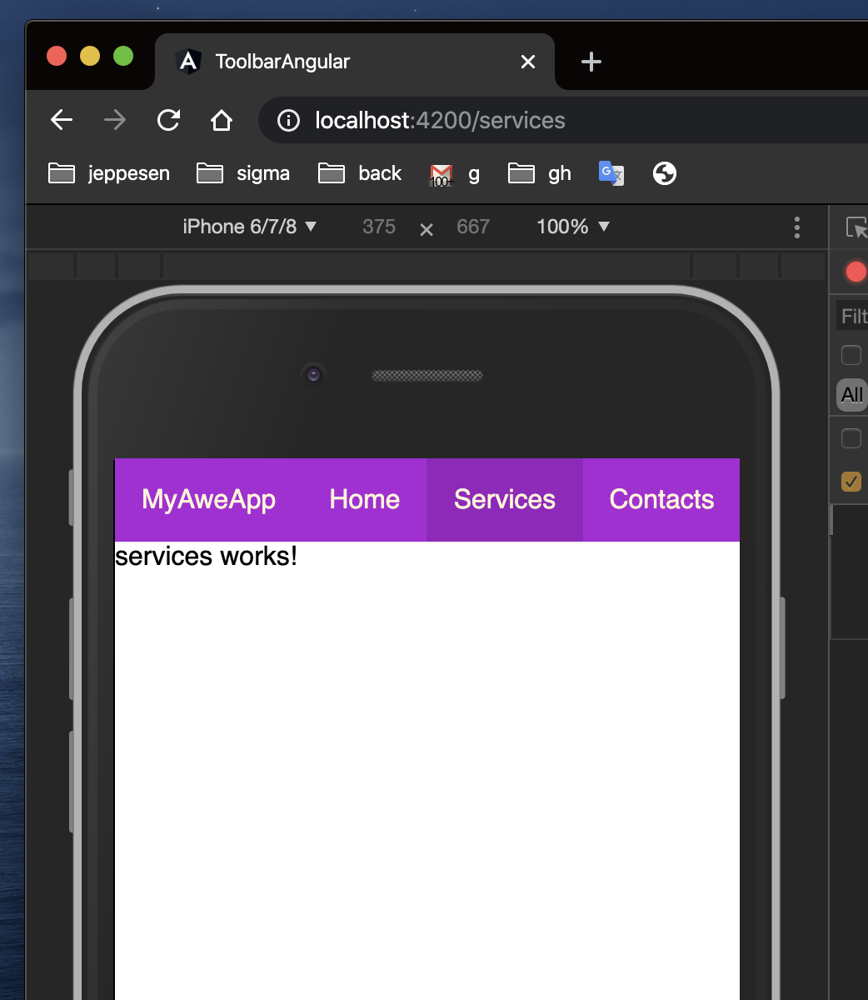
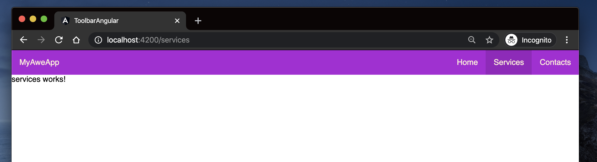

# AngularToolbar
Learn how to easy and quick design and implement simple toolbar with Angular

## site routes and components pages

let's create 3 components for needed pages: Home, Services and Contacts:

```bash
ng g c components/home
ng g c components/services
ng g c components/contacts
```

and configure routes in `app-routing.module.ts` file:

```typescript
// skipped before...
import { HomeComponent } from './components/home/home.component';
import { ServicesComponent } from './components/services/services.component';
import { ContactsComponent } from './components/contacts/contacts.component';

const routes: Routes = [
  { path: '', component: HomeComponent },
  { path: 'services', component: ServicesComponent },
  { path: 'contacts', component: ContactsComponent },
];
// skipped after...
```

## html structure

main `app.component.html` structure should looks like so:

```html
<header id="header">
  <div id="banner">MyAweApp</div>

  <div class="spacer"></div>

  <ul id="menu">
    <li><a href="#" routerLink="/">Home</a></li>
    <li><a href="#" routerLink="/services">Services</a></li>
    <li><a href="#" routerLink="/contacts">Contacts</a></li>
  </ul>
</header>

<router-outlet></router-outlet>
```

## styles

global styles in `styles.scss` file, just doing basic reset css and setting up font we need:

```css
* {
  margin: 0;
  padding: 0;
}

body {
  font-family: "Roboto", sans-serif, Arial;
}
```

finally, our `app.component.scss` scoped styles should be as follows:

```scss
$primaryBgColor: rgb(173, 16, 215);
$activeLinkBgColor: darken($primaryBgColor, 5%);
$primaryColor: #fff5d7;

header#header {
  display: flex;
  background-color: $primaryBgColor;
  color: $primaryColor;

  #banner {
    padding: 1em;
  }

  .spacer {
    flex: 1;
  }

  ul#menu {
    display: flex;

    li {
      padding: 1em;
      list-style: none;

      a {
        text-decoration: none;
        color: $primaryColor;
      }

      &:hover {
        background-color: $activeLinkBgColor;
      }
    }
  }
}

@media (width: 414px) {
  ul#menu {
    padding-right: 1em;
  }
}
```

## results

Mobile:



Desktop:



<!--

This project was generated with [Angular CLI](https://github.com/angular/angular-cli) version 8.3.22.

## Development server

Run `ng serve` for a dev server. Navigate to `http://localhost:4200/`. The app will automatically reload if you change any of the source files.

## Code scaffolding

Run `ng generate component component-name` to generate a new component. You can also use `ng generate directive|pipe|service|class|guard|interface|enum|module`.

## Build

Run `ng build` to build the project. The build artifacts will be stored in the `dist/` directory. Use the `--prod` flag for a production build.

## Running unit tests

Run `ng test` to execute the unit tests via [Karma](https://karma-runner.github.io).

## Running end-to-end tests

Run `ng e2e` to execute the end-to-end tests via [Protractor](http://www.protractortest.org/).

## Further help

To get more help on the Angular CLI use `ng help` or go check out the [Angular CLI README](https://github.com/angular/angular-cli/blob/master/README.md).

-->
